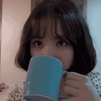
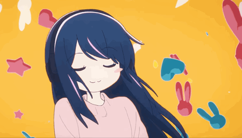

  

  

  
<b> 📂 ✨ About Me</b>

   

  

  
I'm just a human who loves building: discord bots, websites, tools, and anything I want. I have fun doing that, so I think this is better than being the best.

  
I like art and I strive to turn everything I do into a painting.

  
I like to listen to songs when I'm studying, playing, coding, drawing, and any time.

  

   

My Spotify Playlist

  

    
  

my discord account

  

    

---

<h3 align="center">🖥️ Skills & Tools</h3>

###

  

---

## 🚀 Projects

| Project Name | Description | Status |
|--------------|-------------|--------|
| **Star Bot™️** | Ai Bot & a surprise | My Bot Coming soon |
| **Avatar System v1** | Send Avatars & Banner & Profiles  | 50% |
| **System Bot v0.5** | you can use it as template | 90% |
| **System Bot For Designer** | You can use it on your server to improve the experience between you and the customer, on the one hand, organizing and accelerating the receipt of orders - system orders - and much more, explore it yourself | soon |
| **Wait wait this not all my projects** | You can see all of my projects in |  **[Repositories](https://github.com/Velrosy?tab=repositories)** |

---

  <!-- Profile Views -->
  
  
  <!-- Followers -->
  

  <!-- GitHub Stars -->
  

  <!-- Discord Server -->
  

    <h2> 📊 GitHub Stats</h2>
    
    

    
<picture>
  <source
    media="(prefers-color-scheme: dark)"
    srcset="https://card.shiina.xyz/card/Velrosy?theme=rose"
  />
  
</picture>

> ✨ “I don’t just build stuff to show off — I build things that solve real problems.”
> 
> 👋 “check out my work and follow me for more.“

---

  <em>Thanks for your time! 🤍</em> 
  🩷 <em>May your day be as lovely as you are.</em>

